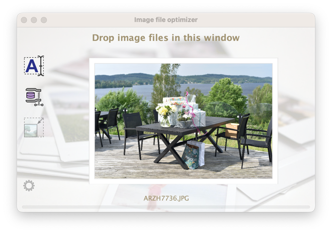

= Photo file date renamer

A user-friendly tool to add the date of photography to the file name of a set of photo files dropped in the application window. You can also drop a folder into the application window as the renamer will traverse any subdirectories in search for photo files to rename.

The application will also optimise the image file size by re-saving your image if it is a JPG image file and if it will save 20% or more in file size. The re-save is done with a JPG quality of 0.9, so yes, there is a very little loss of image quality.

The file will not be renamed twice if you would accidentally run a file twice through the renamer application. The file will not be renamed if it already has a filename that match the pattern it should be renamed to.

.PhotoFileDateRenamer application window

== How to build

(There is a precompiled binary file in `bin/PhotoFileDateRenamer.jar`.)

Use maven to build this java program.

`mvn clean package`

You will find a created jar file at `target/PhotoFileDateRenamer.jar`.

=== Prerequisites

* Java - a fairly modern version will do. For your own sake, stay above Java 8.
* Maven

== How to run

Execute the jar file by:

`java -jar PhotoFileDateRenamer.jar`

== Yes, fine and all that, but why?

If you have heaps of old photos laying around your hardrive. You now have a tool to easy rename them to be able to organize them by date and occasion.

I created this program because I love to take photos with my DSLR camera, and my mobile phone camera. My partner love to take photos as well, and she loves to create magnificent https://www.ifolor.co.uk/downloads[photo albums] with the pictures taken.

However, when we gather all the pictures taken (a lot of them) they are all unsorted in a mess. And for (old) photos, you are not always able to sort them on creation date or modified date in your file browser. The date stamps can be messed up during copy/transfer to other machines or operating systems.

This application fixes almost every image file name to include the date and time stamp at the very beginning of the file name. +
Thus allow us to list all the picture files from all cameras, with different file names and sequence numbers, in chronological order. Which makes it so much easier to handle and sort when making photo albums.

== New file name format

The file format of the renamed photo files is simply: +
`DSC_5864.JPG` -> `<date and time> DSC_5864.JPG`

The format of the "date and time" part is the https://en.wikipedia.org/wiki/ISO_8601[ISO 8601] date format `yyyy-MM-dd HHmm`.

--"Why that format (ISO 8601) and not another obscure format used by my country" you may ask?  +
--Because it makes all your photo files align nicely in chronological order when you sort them alphabetically. ... And because it.is.THE.ISO,the.fri*\*ng.international.standard, you non-conformant! *wink*

== Photo capture date extraction

The photo capture date is extracted from (in descending priority):

* EXIF information, `IFD0Directory - DateOriginal` (if file is `jpg`, `jpeg`, `gif`, `png`, and EXIF information is available)
* EXIF information, `QuickTimeMetadataDirectory - CreationDate` (if file is `mov` and EXIF information is available)
* EXIF information, `Mp4Directory - CreationTime` (if file is `mp4` and EXIF information is available)
* EXIF information, `ExifIFD0Directory - DateTimeOriginal`(if file is `NEF` and EXIF information is available)
* xmp metadata information, `Date` (if file is `xmp` and `Date` and `DigitizedDateTime` information is available)
* xml information, `Date` (if file is `aae` and `Date` information is available)
* File creation date or file modified date, if any is available and before the other, and yet plausible old (after year 1990).
