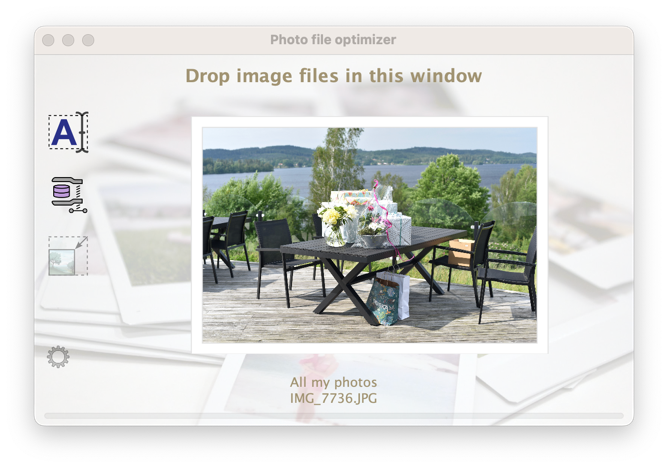
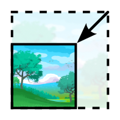

= Photo file optimizer

A user-friendly tool to process photographs taken by high-end digital cameras (DSLRs), digital cameras or mobile phones.

.PhotoFileOptimizer application window

== File rename

A user-friendly tool to add the date of photography to the file name of a set of photo files dropped in the application window. You can also drop a folder into the application window as the renamer will traverse any subdirectories in search for photo files to rename.

The file will not be renamed twice if you would accidentally run a file twice through the renamer application. The file will not be renamed if it already has a filename that match the pattern it should be renamed to.

== File size

The application can also optimise the image file size by re-saving your image if it is a JPG image file.

It can re-save your jpg files, and it will only save the new file if the new file is reduced by a configurable factor or more in file size. The re-save is done with a loss of quality, the JPG quality level is configurable. So yes, there may be a little loss of image quality in the process but there can be a huge win in disc free space.

== Image size

The application can also resize the image.
It can shrink your jpg images (not enlarge them) to a configured maximum pixel width and maximum pixel height while keeping the width-height aspect of your image. If the original image is already within the configured dimensions no action is taken.

== General

You can drop a single image file or a bunch of image files. They will be processed by the optimizer one by one. You can even in include directories among the files you drop. Any directory or subdirectory to that directory will be traversed for files to process.

Any resave, or resize of jpg images will keep as much of the original EXIF information as possible.

The Photo file optimizer process your dropped files in a serial workflow (no parallel processing of several files at the same time), to be able to show a preview of the image in the application window.

This is an application with a UI. It was never designed to handle in put or options at the command line. There is no command line interface.

== How to build

(There is a precompiled binary file in `bin/PhotoFileOptimizer.jar`.)

Use maven to build this java program.

`mvn clean package`

You will find a created jar file at `target/PhotoFileOptimizer.jar`.

=== Prerequisites

* Java - a fairly modern version will do. For your own sake, stay above Java 8.
* Maven

== How to run

Execute the jar file by:

`java -jar PhotoFileOptimizer.jar`

=== Configuration

Nope, no can do. No external configuration (yet). Use it if you like it.

== Yes, fine and all that, but why?

If you have heaps of old photos lying around your disc. You now have a tool to easy rename them to be able to organize them by date and occasion.

I created this program because I love to take photos with my DSLR camera, and my mobile phone camera. My partner love to take photos as well, and she loves to create magnificent https://www.ifolor.co.uk/downloads[photo albums] with the pictures taken.

However, when we gather all the pictures taken (a lot of them) they are all unsorted in a mess. And for (old) photos, you are not always able to sort them on creation date or modified date in your file browser. The date stamps can be messed up during copy/transfer to other machines or operating systems.

=== File renaming

This application fixes almost every image file name to include the date and time stamp at the very beginning of the file name. +
Thus allow us to list all the picture files from all cameras, with different file names and sequence numbers, in chronological order. Which makes it so much easier to handle and sort when making photo albums.

=== File resaving

Many high-end camera brands put speed before heavy computations and save their jpg files fast but not file size optimized. This program can re-save your jpg files with minimal loss in quality but with a potential to free a lot of disc space.

== New file name format

The file format of the renamed photo files is simply: +
`DSC_5864.JPG` -> `<date and time> DSC_5864.JPG`

The format of the "date and time" part is the https://en.wikipedia.org/wiki/ISO_8601[ISO 8601] date format `yyyy-MM-dd HHmm`.

--"Why that format (ISO 8601) and not another obscure format used by my country" you may ask?  +
--Because it makes all your photo files align nicely in chronological order when you sort them alphabetically. ... And because it.is.THE.ISO,the.fri*\*ng.international.standard, you non-conformant! *wink*

== Photo capture date extraction

The photo capture date is extracted from (in descending priority):

* `jpg`, `jpeg`, `gif`, `png` as file name suffix and EXIF information is available then EXIF `IFD0Directory - DateOriginal` is used.
* `mov` as file name suffix and EXIF information is available then EXIF `QuickTimeMetadataDirectory - CreationDate` is used.
* `mp4` as file name suffix and EXIF information is available then EXIF `Mp4Directory - CreationTime` is used.
* `nef` as file name suffix and EXIF information is available then EXIF `ExifIFD0Directory - DateTimeOriginal` is used.
* `xmp` as file name suffix and xmp metadata information with `Date` and `DigitizedDateTime` is available then xmp metadata information `Date` is used.
* `aae` as file name suffix and xml with `Date` is available then `Date` is used.
* File creation date or file modified date, if any is available and before the other, and yet plausible old (after year 1990).

== Future feature ideas

* Option to process photo files in parallell to speed things up.
* Command line interface to execute application in commandline mode (without UI).
* Settings for date pattern when renaming photo files.
* Settings for resave parameters (threshold and JPG quality).
* Persist settings to file (if possible).

== Disclaimer

No warranty or any responsibility is taken for this application to work properly or your precious image file getting damaged. +
(If you hesitate, please, try the application out on a copy of your photocollection.)

That being said, I have used this application for all of my own and the family photos without any hesitation for 4 years and rely on it for all photos we have taken. As I am pretty protective of my precious photos I've taken a fair bit of consideration programming it, and a lot of practical testing before trusting it.
